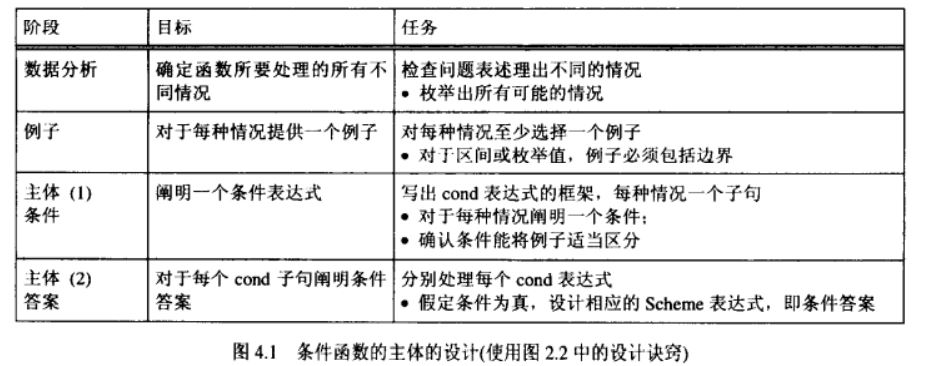

# 4.4 条件函数的设计
与设计一般函数相比，条件函数的设计比较复杂，程序设计者必须了解问题表述中所列出的不同情况并加以识别。  
为了强调这种思想的重要性，这里介绍并讨论条件函数的设计过程。该过程引入了一个新的设计诀窍数据分析，他要求程序设计这理解问题表述中所涉及的不同情况。因此，有必要对2.5节中讨论的程序设计诀窍中的例子和程序题部分进行一些修改。  
## 数据分析和定义：
了解了问题表述所涉及的不同情况后，必须确定它们的数据定义data definition，下面对这个思想进行深入讨论。  
> 对于数学函数，一种好的策略是画出数轴，然后针对不同的情况确定相应的区间。例如考虑interest-rate函数的合约：  
```
;; interest-rate : number -> number
;; 确定相应于存款额amount（大于等于ling
略……
```

### 设计诀窍总览

