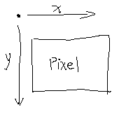

# 6.2 补充练习：绘制简单图形
DrRacket提供的教学软件包**draw.ss**包含的绘图操作：
```
;; 下述结果若是true，就能成功改变画布的状态：

;; 1.在画布上绘制直线，输入为2个posn结构体和1种颜色，其中posn结构体表示直线的起点和终点；
draw-solid-line

;; 2. 在画布上绘制长方形，它读入4个参数，分别是表示长方形左上角位置的posn结构体，长方形的宽度，长方形的高度，以及边的颜色；
draw-solid-rect

;; 3. 在画布上绘制圆盘，它读入3个参数，“圆盘中心的posn结构体” “圆盘的半径” “圆盘颜色”
draw-solid-disk

;; 4. 画布上绘制圆，它读入3个参数，分别是表示圆心位置的posn结构体，圆的半径以及颜色。
draw-circle
```


实例：
```
;; 绘制直线
;; 15 11为起点的坐标，22 45为终点的坐标，
;; 'red'是颜色
(draw-solid-line (make-posn 15 11)(make-posn 22 45) 'red)

;; 绘制长方形
;; x1 y1 为长方形左上角的坐标
;; 20 为长方形的宽度
;; 30 为长方形的高度
;; 'red 为边的颜色
(draw-solid-ract (make-posn x1 y1) 20 30 'red)

;; 绘制圆盘
;; 22 33是圆盘中心的坐标
;; 8 是半径
;; 'red 是颜色
(draw-solid-disk (make-posn 22 33) 8 'red)

;; 绘制圆形
;; 圆心坐标 12 13
;; 半径 9
;; 颜色 'red
(draw-circle (make-posn 12 13) 9 'red)
```

清除画布上对应的图形函数：
```
clear-solid-line
clear-solid-rect
clear-solid-disk
clear-circle
```
