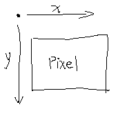

# 6.2 补充练习：绘制简单图形
DrRacket提供的教学软件包**draw.ss**包含的绘图操作：
```
;; 下述结果若是true，就能成功改变画布的状态：

;; 1.在画布上绘制直线，输入为2个posn结构体和1种颜色，其中posn结构体表示直线的起点和终点；
draw-solid-line

;; 2. 在画布上绘制长方形，它读入4个参数，分别是表示长方形左上角位置的posn结构体，长方形的宽度，长方形的高度，以及边的颜色；
draw-solid-rect

;; 3. 在画布上绘制圆盘，它读入3个参数，“圆盘中心的posn结构体” “圆盘的半径” “圆盘颜色”
draw-circle
```



