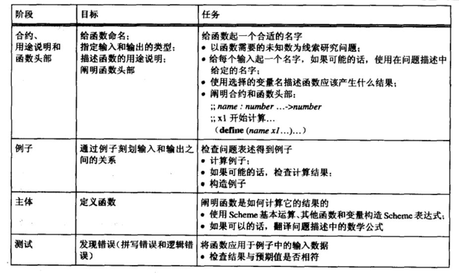

# 设计诀窍
## 目录
- 设计诀窍的的基本部分
- 设计诀窍的类型
- 要正确地设计程序，必须
  
## 设计诀窍的的基本部分  
1. 问题分析和数据定义
2. 合约，用途说明与结果的描述，函数头部
3. 例子
4. 函数模板
5. 函数定义
6. 测试
  
### 2. 合约，用途说明与结果的描述，函数头部
1. 理解程序的目的，程序设计的目标是创建一个接受输入输出并产生结果的机制。因此在开发程序时应该给每一个程序提供一个有意义的名字，并且说明输入输出的数据类型，这就是程序的合约。  
> 例如程序`area-of-ring`的合约：`;; area-of-ring: number number -> number`  
  
2. 在程序中加入函数头部，函数头部复述了程序的名字。  
分别给每个**输入**取一个名字，这些名字是（代数）变量，是程序的参数。  
第一个输入是outer，第二个输入是inner；  
> 例如程序的函数头部：`(define (area-of-ring outer inner) ...)`  
  
3. 最后基于合约和参数，简要阐明一下程序的用途说明，它是程序要完成的任务的简短注释。对于大多数程序，一到两行就足够，更大的程序则需要更多的信息来说明其用途。  
> 现在完整的程序如下：  
```
;; area-of-ring : number number -> number
;; 计算一个半径为outer，洞的半径为inner的圆环的面积
(define (area-of-ring outer inner) ...)
```
如果问题表述包含了数学公式[^1]
[^1]: 公式中不同变量的数目可能就是程序的输入数。  
### 3. 例子
为了更好地了解程序要计算什么，需要构造一些输入并确定输出到底是什么。  
> 例如，对于输入 5 和 3，程序`area-of-ring `的计算结果应为 50.24，这是因为程序的输出是外圆盘的面积与内圆盘面积之差。  
> 在用途说明中加入 例子[^2]：  
[^2]: 首先，它是唯一可靠的在程序测试中发现逻辑错误的途径。如果借助最终得到的程序来构造例子，有可能会轻信程序，因为运行程序比预测它会做什么容易得多。第二，例子使我们思考数据计算过程，这对于将遇到的复杂程序体的设计是至关重要的。最后，例子是用途说明的非正式表达。此后的程序读者会喜欢这些抽象概念的具体说明。
```
;; area-of-ring : number number -> number
;; 计算一个半径为outer，洞的半径为inner的圆环的面积
;; 例子：(area-of-ring 5 3)的结果为50.24
(define (area-of-ring outer inner) ...)
```
### 5. 程序体
最后必须阐明 程序体[^3]，即必须将函数头部中的“……”替换为表达式，该表达式使用Scheme中的基本操作和已定义或即将定义的程序，由参数计算出结果。  
[^3]: 只有理解了如何从给定的输入计算出结果，才可能阐明程序题。如果输入和输出的关系由数学公式给出，只要将数学公式转换为Scheme表达式即可。如果给定的是一个书面叙述的问题，我们必须细心地挖掘其中的信息并构造相应的表达式。最后，观察并理解如何从特定的输入得到输出的例子可能对程序体的设计也会有所帮助。  
> 在我们所讨论的例子中，计算任务是一个非正式说明的公式，它使用了先前定义的程序`area-of-disk`，下面是它的Scheme翻译：  
```
(define (area-of-ring outer inner)
  (- (area-of-disk outer)
  (area=of-disk inner)))
```
### 6. 测试
在完成了程序定义之后，还必须测试程序。至少应该确定对于给定的例子，程序计算所得结果与预期数值是否相符。  
1. 为了简化程序测试过程，通常可以在Definitions窗口的下面如果添加等式一样添加一些例子。  
2. 然后，按下Execute按钮，计算它们，并观察对于这些例子程序是否正常工作。  
> 测试不能保证程序对所有可能的输入都产生正确的输出，因为可能的输入数目通常是无限的，但测试可以揭示语法错误、运行问题以及逻辑错误。  
> 对于错误的程序输出，必须特别关注程序例子。有可能例子本身就是错误的，也有可能程序包含了逻辑错误，也有可能例子和程序都有错误。不管是何种情况，都必须再次历经程序开发的每一步。

### 设计诀窍总览

## 设计诀窍的类型
- 输入数据和程序之间的关系：  
	- 本书有一半的设计诀窍涉及**输入数据和程序之间的关系**。它们描述了如何从输入数据的描述得出整个程序的模板，这种基于数据驱动的程序设计方式最常见，易于创建、理解、扩展和修改。  
- 生成递归（generative recursion）：递归型程序可以被重复调用以处理新的问题  
- 累积（accumulation）：带累计器的程序在处理输入的过程种收集数据  
- 历史敏感性（history sensitivity）：历史敏感性程序可以记住程序被多次调用的信息  
- 抽象：把两个（或更多）相似的设计概括为一个并由它衍生最初示例。  
  
## 要正确地设计程序，必须：
1. 分析通常使用文字表述的问题
2. 在抽象表达问题实质的同时使用例子进行说明
3. 用精确的语言阐明所表述的语句和注释
4. 通过检查、测试对上述活动进行评价和修改
5. 关注细节